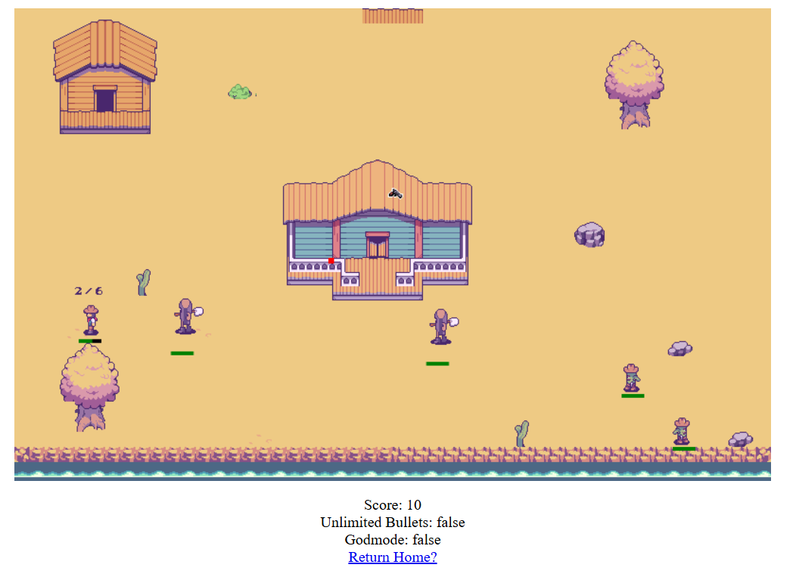
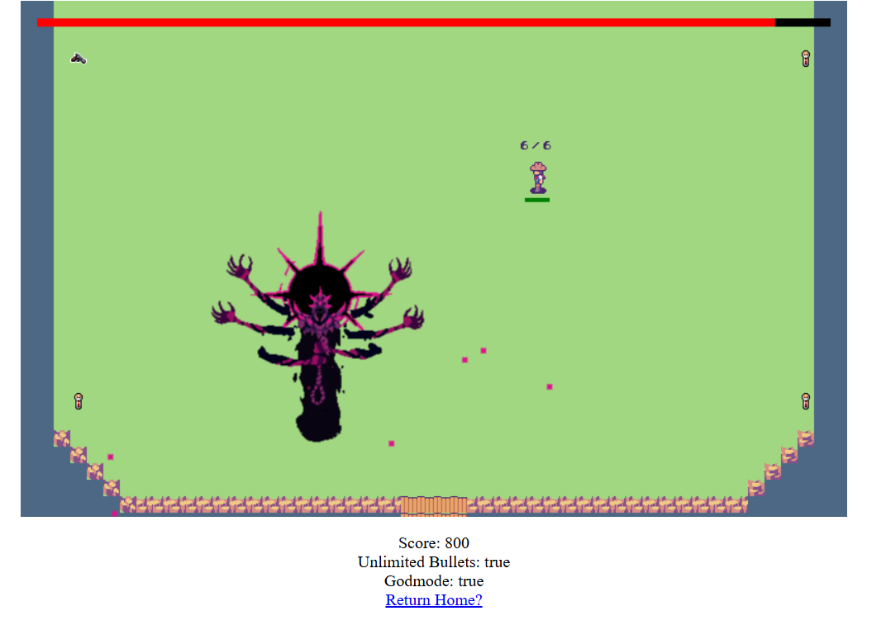

# Messy in the West

Messy in the West is a top-down, tile-based western shooter game built using JavaScript and HTML5 Canvas.

The project combines a browser-based game with a Flask backend and SQLite database to provide user accounts and a leaderboard system.

## Screenshots

### Main area



### Boss Area



## Features

- Top-down tile-based shooter
- Player movement using the arrow keys
- Directional shooting
- Dodge mechanic with a cooldown
- Multiple levels
- Enemy combat
- Boss fight
- Animated sprites
- Sound effects and background music
- Score system
- User registration and login
- SQLite-backed leaderboard
- Flask backend for application and user management

## Controls

| Key | Action |
|---|---|
| Arrow Keys | Move |
| W | Shoot Up |
| A | Shoot Left |
| S | Shoot Down |
| D | Shoot Right |
| Space | Dodge |
| R | Reload |

## Technologies

- JavaScript
- HTML5 Canvas
- HTML
- CSS
- Python
- Flask
- SQLite
- Flask-WTF
- Flask-Session

## Project Structure

```text
messy-in-the-west/
├── app.py
├── database.py
├── forms.py
├── schema.sql
├── requirements.txt
├── static/
│   ├── game.js
│   ├── game.css
│   ├── audio/
│   └── sprites/
└── templates/
    ├── index.html
    ├── game.html
    ├── leaderboard.html
    ├── login.html
    └── register.html
```

## Running the Project

### 1. Clone the repository

```bash
git clone https://github.com/Nathan-Gin/messy-in-the-west.git
cd messy-in-the-west
```

### 2. Create a virtual environment

On Windows:

```powershell
python -m venv venv
```

Activate the virtual environment:

```powershell
venv\Scripts\activate
```

### 3. Install dependencies

```powershell
pip install -r requirements.txt
```

### 4. Run the Flask application

```powershell
flask run
```

If `flask run` does not work, use:

```powershell
python -m flask run
```

### 5. Open the game

Open:

```text
http://127.0.0.1:5000
```

## Game

The game is rendered using an HTML5 Canvas and JavaScript. The game page contains an 800 × 500 canvas alongside a HUD displaying the player's score, ammunition and game outcome.

## User Accounts and Leaderboard

The application includes user registration and login functionality using Flask forms.

Player information and leaderboard data are stored using SQLite. The database is created locally and is intentionally excluded from the Git repository.

## What I Learned

This project gave me experience developing an interactive browser-based application while working with both frontend and backend technologies.

On the frontend, I worked with JavaScript and HTML5 Canvas to implement the game loop, player movement, shooting, collision and gameplay logic, sprite animation, audio and level progression.

On the backend, I used Flask and SQLite to implement user registration, login and leaderboard functionality.

The project also gave me experience connecting a JavaScript application to a Python backend and organising a larger project across multiple files and technologies.

## Future Improvements

Potential improvements include:

- More levels and enemy types
- Improved enemy AI
- More polished UI
- Additional weapons and gameplay mechanics
- Improved browser compatibility
- Further separation and organisation of game systems
- Improved sprite collisions with environment

## Author

Nathan Gin
